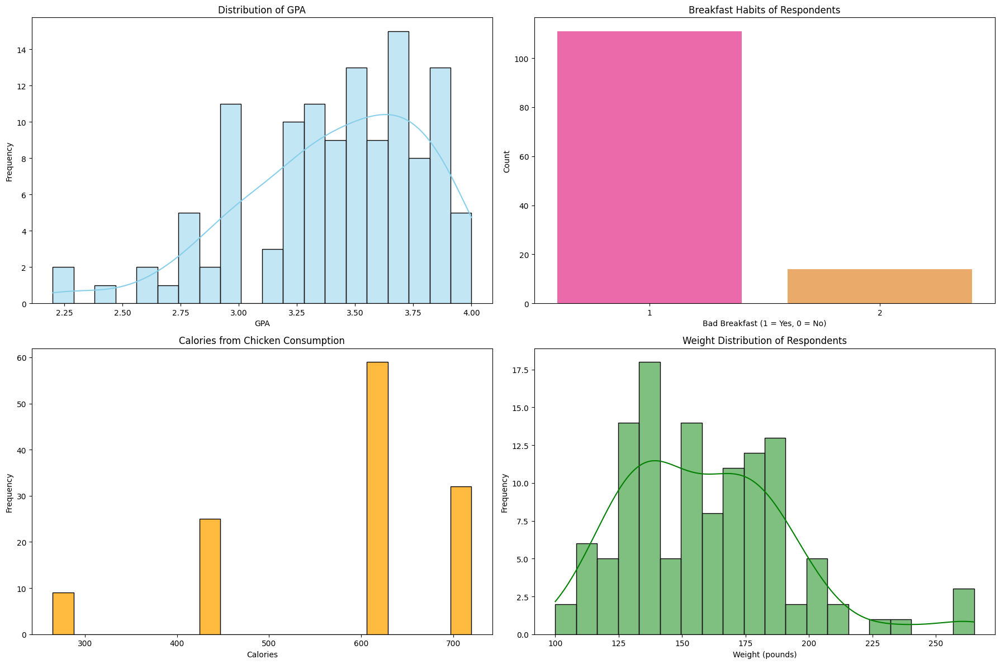
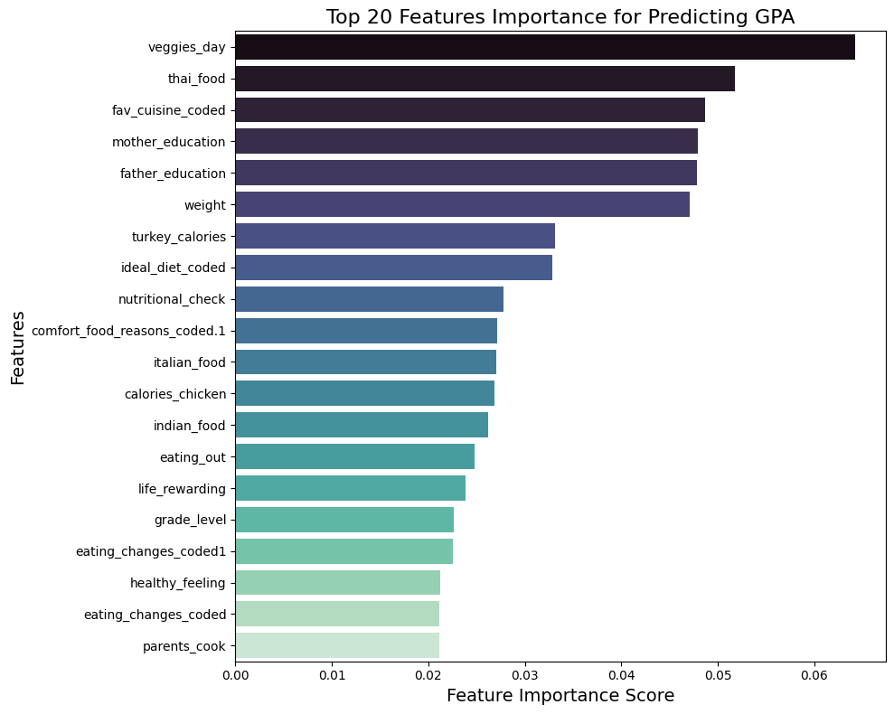

# Exploratory Data Analysis on Food Coded Dataset

## Overview
This project provides an exploratory data analysis (EDA) on the Food Coded dataset. The analysis focuses on uncovering insights related to dietary habits, preferences, and other factors influencing food choices. It includes data cleaning, visualization, and statistical exploration to better understand the dataset's structure and key trends.

---

## Table of Contents
1. [Introduction](#introduction)
2. [Dataset Description](#dataset-description)
3. [Analysis Overview](#analysis-overview)
4. [Sample Visualizations](#sample-visualizations)
5. [Usage Instructions](#usage-instructions)
6. [Requirements](#requirements)
7. [Conclusion](#conclusion)

---

## Introduction
Understanding food habits and preferences is essential for nutrition research, policy-making, and market analysis. This notebook explores the Food Coded dataset, which includes attributes related to food choices, demographics, and other influencing factors.

---

## Dataset Description
The dataset contains the following key features (expand based on your data):
- **Feature 1**: Description (e.g., Age of the individual)
- **Feature 2**: Description (e.g., Dietary preferences)
- **Feature 3**: Description (e.g., Frequency of fast-food consumption)
- *(Add more features as needed.)*

---

## Analysis Overview
The notebook performs the following steps:
1. **Data Cleaning and Preprocessing**
   - Handling missing or null values.
   - Correcting inconsistencies in categorical data.
   - Feature engineering, if necessary.

2. **Exploratory Data Analysis**
   - **Univariate Analysis**: Examining individual features (e.g., histograms, pie charts).
   - **Bivariate Analysis**: Exploring relationships between two variables (e.g., scatter plots, correlation heatmaps).
   - **Multivariate Analysis**: Analyzing patterns across multiple variables.

3. **Insights and Observations**
   - Key findings about dietary preferences, health trends, and demographics.

---

## Sample Visualizations
Here are some visualizations included in the notebook:

### Plot



### Plot 2



---

## Usage Instructions
1. Clone this repository or download the notebook file.
2. Install the required dependencies using pip:
   ```bash
   pip install -r requirements.txt
