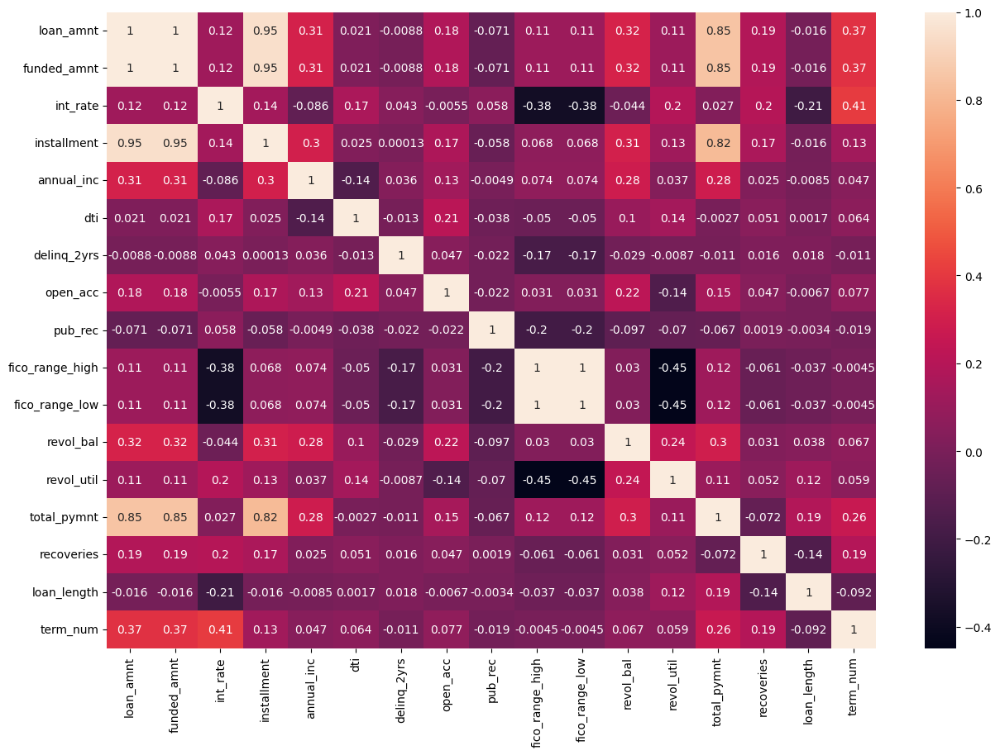
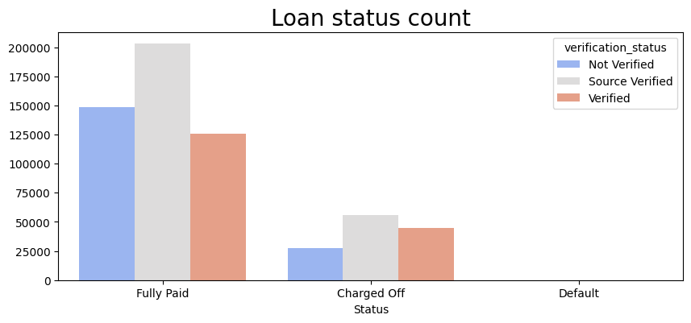
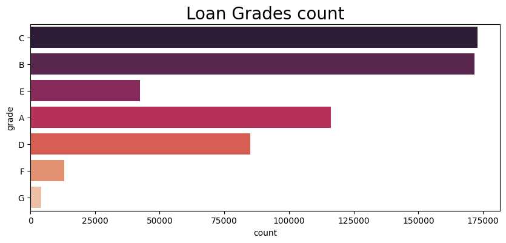
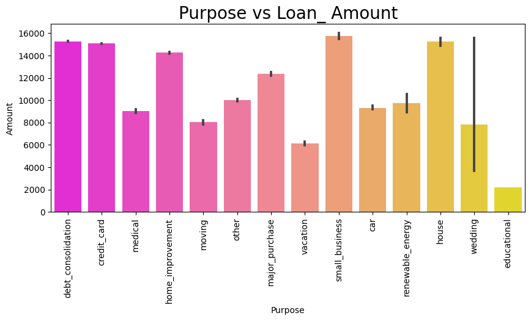
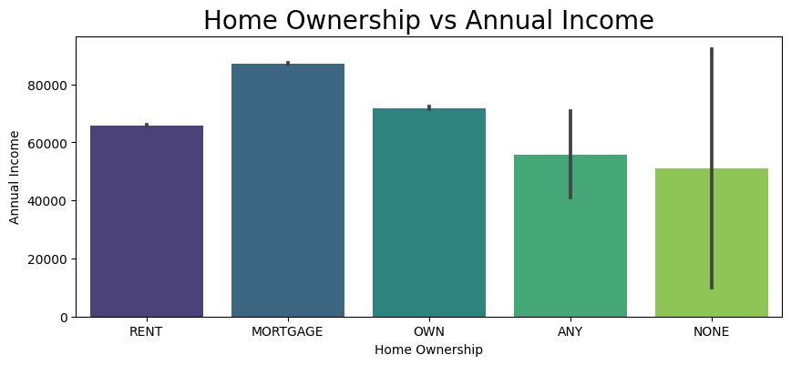
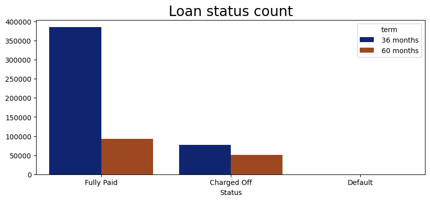
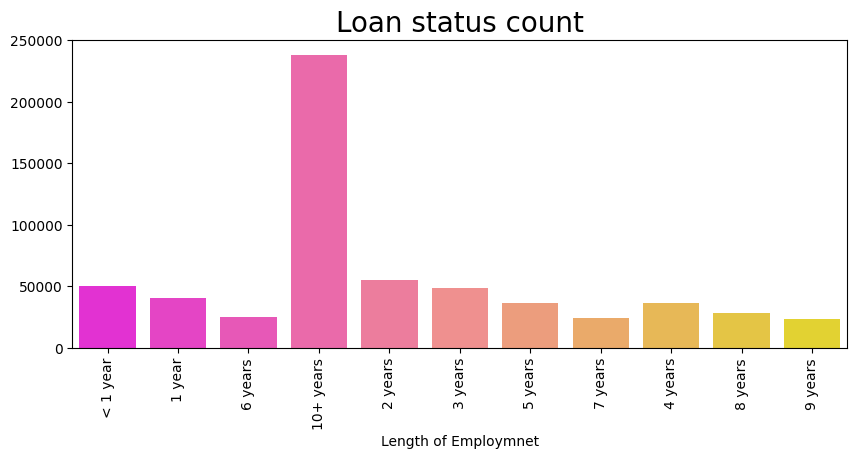

# Lending Club Dataset Exploratory Data Analysis (EDA)

This repository contains a Jupyter Notebook that performs an exploratory data analysis (EDA) on the Lending Club dataset. The analysis focuses on understanding the dataset, identifying trends, and uncovering patterns that can be used for financial decision-making or predictive modeling.

## Table of Contents

1. [Introduction](#introduction)
2. [Dataset Overview](#dataset-overview)
3. [Requirements](#requirements)
4. [Project Structure](#project-structure)
5. [Key Insights](#key-insights)
6. [Usage Instructions](#usage-instructions)
7. [Acknowledgments](#acknowledgments)

---

## Introduction

The Lending Club dataset provides financial information about loans issued through the Lending Club platform. This analysis seeks to:

- Understand the data distribution.
- Perform data cleaning and preprocessing.
- Explore relationships between key variables.
- Visualize trends and patterns.

## Dataset Overview

The dataset includes various attributes related to loans, such as loan amounts, interest rates, loan grades, and borrower details. These features are analyzed to gain insights into lending practices and borrower behavior.

## Requirements

To run this notebook, you need the following dependencies:

- Python 3.x
- Jupyter Notebook or JupyterLab
- Pandas
- NumPy
- Matplotlib
- Seaborn
- Other libraries as required (see the imports in the notebook)

Install the dependencies using pip:

```bash
pip install -r requirements.txt
```

## Project Structure

```
.
|-- EDA_Lending_Club_dataset.ipynb  # Main analysis notebook
|-- README.md                       # Project documentation
|-- requirements.txt                # List of required Python libraries
```

## Key Insights

This notebook covers:

- **Data Cleaning**: Handling missing values, outliers, and inconsistent data entries.
- **Univariate Analysis**: Distribution of individual features (e.g., loan amounts, interest rates).
- **Bivariate Analysis**: Relationships between variables (e.g., loan amount vs. interest rate).
- **Trend Analysis**: Key trends in the data over time.

### Sample Visualizations

> **Note:** Replace the placeholders below with actual visualizations from the notebook.
# Plots


1. Distribution of Loan Amounts:



### Plot


2. Interest Rate vs. Loan Grade:



### Plot 



3. Time-Based Trends:



### Plot



## Usage Instructions

1. Clone this repository:

   ```bash
   git clone <repository_url>
   ```

2. Open the Jupyter Notebook:

   ```bash
   jupyter notebook EDA_Lending_Club_dataset.ipynb
   ```

3. Run the cells sequentially to perform the analysis.

4. Review the output visualizations and insights.

## Acknowledgments

- Lending Club for providing the dataset.
- Open-source Python community for the data analysis libraries.

---

Feel free to contribute to this project by opening issues or submitting pull requests!