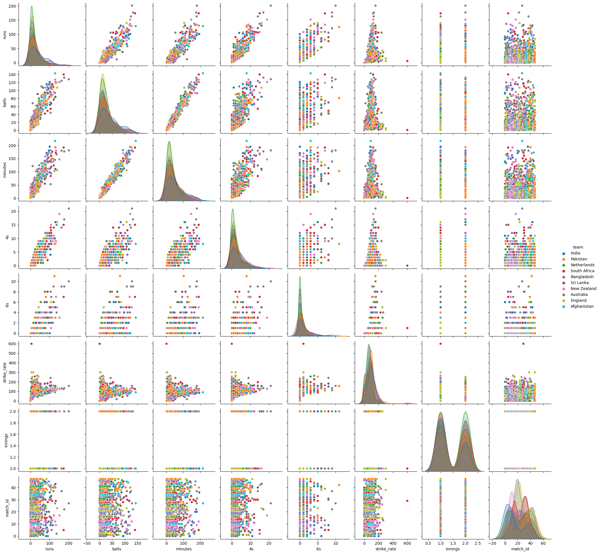
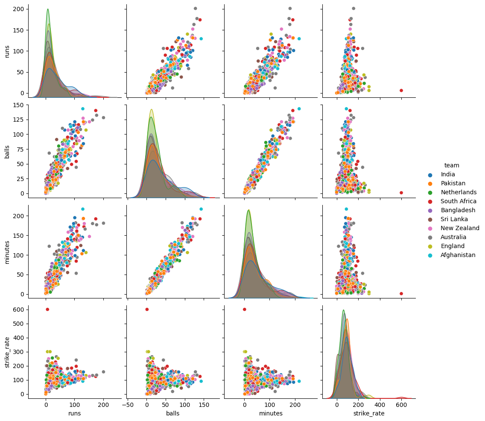

# Exploratory Data Analysis on Cricket Dataset

## Overview
This notebook performs an exploratory data analysis (EDA) on a cricket dataset, providing insights into various aspects of the data. The analysis includes data cleaning, visualization, and statistical exploration to better understand trends, distributions, and correlations within the dataset.

---

## Table of Contents
1. [Introduction](#introduction)
2. [Dataset Description](#dataset-description)
3. [Data Cleaning and Preprocessing](#data-cleaning-and-preprocessing)
4. [Exploratory Data Analysis](#exploratory-data-analysis)
5. [Insights and Observations](#insights-and-observations)
6. [How to Use This Notebook](#how-to-use-this-notebook)
7. [Requirements](#requirements)
8. [Conclusion](#conclusion)

---

## Introduction
This project investigates the provided cricket dataset to uncover patterns and trends. The analysis is intended for cricket enthusiasts, data scientists, and analysts interested in sports analytics.

---

## Dataset Description
The dataset used in this analysis contains the following key attributes:
- **Attribute 1**: Description
- **Attribute 2**: Description
- **Attribute 3**: Description
- *(Expand this section with specific details about your dataset.)*

---

## Data Cleaning and Preprocessing
The following steps were taken to clean and prepare the data:
1. Handling missing values.
2. Removing duplicates.
3. Formatting and transforming data types.
4. *(Add more steps as applicable.)*

# Plots


### Plot 2


## Exploratory Data Analysis
Key analyses performed include:
- **Univariate Analysis**: Visualizations of individual attributes.
- **Bivariate Analysis**: Correlations between different variables.
- **Trends and Patterns**: Analysis of time-series or categorical data trends.

**_Insert images of graphs, plots, or heatmaps here._**

---

## Insights and Observations
1. **Insight 1**: Brief description of a key observation.
2. **Insight 2**: Another key finding.
3. *(You can list more insights derived from the analysis.)*

---

## How to Use This Notebook
1. Clone the repository or download the notebook.
2. Install the required dependencies listed below.
3. Run the notebook step-by-step or specific sections of interest.

---

## Requirements
To run this notebook, you need:
- Python version: **(Specify version, e.g., 3.8 or above)**
- Libraries: Pandas, NumPy, Matplotlib, Seaborn, etc.

Install the requirements using:
```bash
pip install -r requirements.txt
