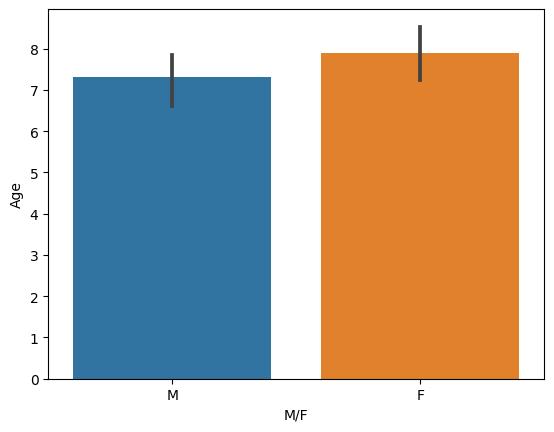
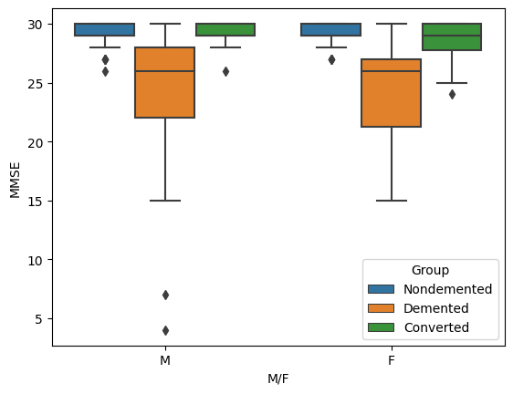
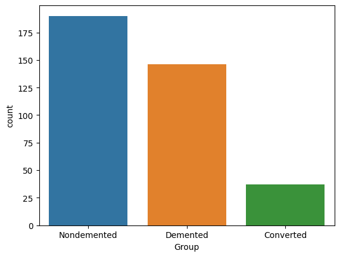
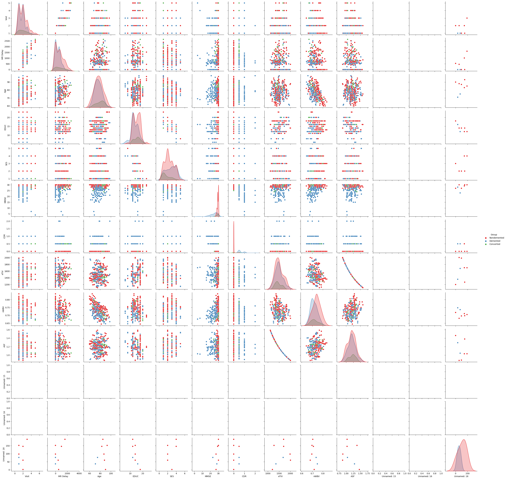
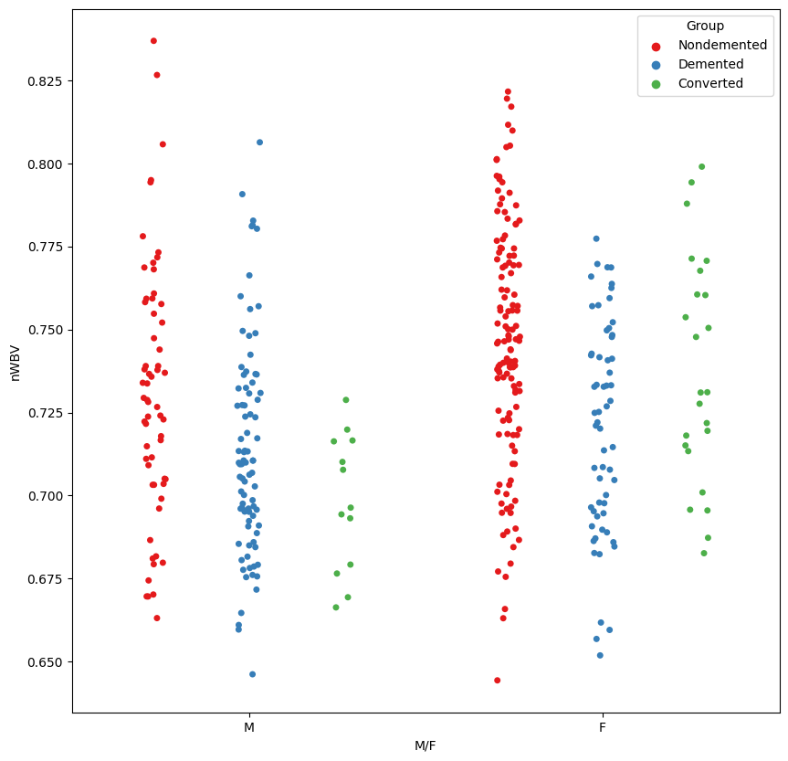

# Exploratory Data Analysis (EDA) on Titanic Dataset

## Overview
This project involves a comprehensive exploratory data analysis (EDA) of the Titanic dataset. Using Python and its data science libraries, the analysis covers data cleaning, preprocessing, and visualization to extract meaningful insights about passengers and survival outcomes. The visualizations are designed to be informative and engaging, making the findings easy to interpret.

---

## Objectives
- Understand the dataset's structure and content.
- Perform data cleaning and preprocessing to handle missing values and inconsistencies.
- Extract insights into passenger demographics, survival rates, ticket classes, and other features.
- Visualize findings through various plots and graphs.

---

## Dataset Description
The Titanic dataset contains the following key features:

- **PassengerId**: Unique identifier for each passenger.
- **Survived**: Survival status (0 = No, 1 = Yes).
- **Pclass**: Ticket class (1 = First, 2 = Second, 3 = Third).
- **Name**: Passenger's name.
- **Sex**: Gender of the passenger.
- **Age**: Age of the passenger.
- **SibSp**: Number of siblings/spouses aboard.
- **Parch**: Number of parents/children aboard.
- **Ticket**: Ticket number.
- **Fare**: Ticket fare.
- **Cabin**: Cabin number (if known).
- **Embarked**: Port of embarkation (C = Cherbourg, Q = Queenstown, S = Southampton).

---

## Key Analysis Steps

### 1. Data Loading
- Load the dataset using `pandas`.
- Display dataset structure and summary statistics.

### 2. Data Cleaning
- Handle missing values in `Age`, `Cabin`, and `Embarked`.
- Encode categorical variables into numerical formats.

### 3. Data Analysis
- **Univariate Analysis**: Study individual features such as age distribution and ticket class.
- **Bivariate Analysis**: Explore relationships between features, such as survival rate vs. gender.
- **Multivariate Analysis**: Assess combined effects of multiple features on survival.

### 4. Data Visualization
Use `matplotlib` and `seaborn` to create various plots, including:
- **Bar Charts**
- **Histograms**
- **Boxplots**
- **Heatmaps**

---

## Example Visualizations

### Survival Rate by Gender


### Plot 2


### Age Distribution


### Pairplot


### Fare Distribution by Class


### Plot 2


---

## Tools and Libraries Used
- **Python**: Programming language for analysis.
- **Jupyter Notebook**: Interactive platform for data analysis.
- **pandas**: Data manipulation and preprocessing.
- **numpy**: Numerical computations.
- **matplotlib**: Basic plotting.
- **seaborn**: Advanced visualization.

---

## Getting Started

### Prerequisites
Ensure you have Python installed along with the required libraries:
```bash
pip install pandas numpy matplotlib seaborn
