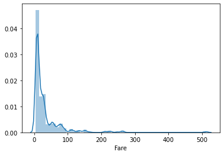
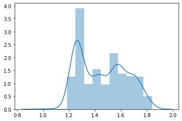
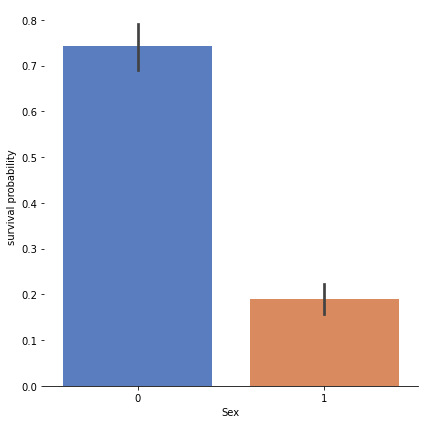
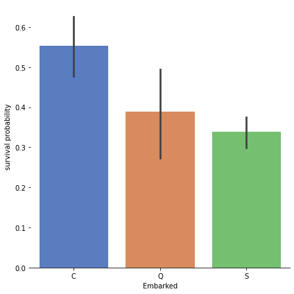
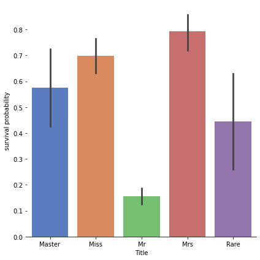

# Exploratory Data Analysis (EDA) on Titanic Dataset

## Overview
This project provides a detailed exploratory data analysis (EDA) of the Titanic dataset. Using Python and its powerful data science libraries, the notebook explores the dataset's structure, performs data cleaning and preprocessing, and uncovers key insights about passenger demographics and survival outcomes. The findings are visualized through various plots, offering an intuitive understanding of the data.

---

## Objectives
- Understand the structure and contents of the Titanic dataset.
- Clean and preprocess the data to handle missing or inconsistent values.
- Extract meaningful insights about passenger demographics, ticket classes, survival rates, and more.
- Visualize findings through informative and engaging plots.

---

## Dataset Description
The Titanic dataset contains information about passengers on the Titanic voyage. Key features include:

- **PassengerId**: Unique identifier for each passenger.
- **Survived**: Survival status (0 = No, 1 = Yes).
- **Pclass**: Ticket class (1 = First, 2 = Second, 3 = Third).
- **Name**: Passenger's name.
- **Sex**: Gender of the passenger.
- **Age**: Age of the passenger.
- **SibSp**: Number of siblings/spouses aboard.
- **Parch**: Number of parents/children aboard.
- **Ticket**: Ticket number.
- **Fare**: Ticket fare.
- **Cabin**: Cabin number (if known).
- **Embarked**: Port of embarkation (C = Cherbourg, Q = Queenstown, S = Southampton).

---


## Key Analysis Steps

### 1. Loading the Data
- Import the dataset using `pandas`.
- Display dataset information and summary statistics to understand the data.

### 2. Data Cleaning
- Handle missing values in columns such as `Age`, `Cabin`, and `Embarked`.
- Convert categorical data into numerical formats for analysis.

### 3. Exploratory Analysis
- **Univariate Analysis**: Study the distribution of individual features (e.g., age, fare, class).
- **Bivariate Analysis**: Explore relationships between features (e.g., gender vs. survival rate).
- **Multivariate Analysis**: Analyze the combined impact of multiple features on survival.

### 4. Data Visualization
Use libraries like `matplotlib` and `seaborn` to create:
- **Bar Charts**
- **Histograms**
- **Heatmaps**
- **Boxplots**

---

## Insights and Conclusions
- Survival was heavily influenced by **gender** (females had higher survival rates).
- **Ticket class** played a significant role in survival, with first-class passengers more likely to survive.
- Younger passengers had higher survival probabilities compared to older ones.
- Fare distribution varied significantly across classes, with first-class tickets being the most expensive.

---

## Example Visualizations
- **Survival Rate by Gender**: Bar chart comparing male and female survival rates.
- **Age Distribution**: Histogram showing the age spread of passengers.
- **Heatmap of Correlations**: Visualizing relationships between numerical features.
- **Fare Distribution by Class**: Boxplot showing fare variations across ticket classes.

## Plot 1



## Plot 2


## Plot 3



## Plot 4


## Plot 5

---

## Tools and Libraries Used
- **Python**: Primary programming language.
- **Jupyter Notebook**: Platform for interactive coding and analysis.
- **pandas**: Data manipulation and preprocessing.
- **numpy**: Numerical computations.
- **matplotlib**: Basic plotting.
- **seaborn**: Advanced visualizations.

---

## Getting Started

### Prerequisites
Ensure you have Python and the required libraries installed. Use the following command to install missing libraries:
```bash
pip install pandas numpy matplotlib seaborn


